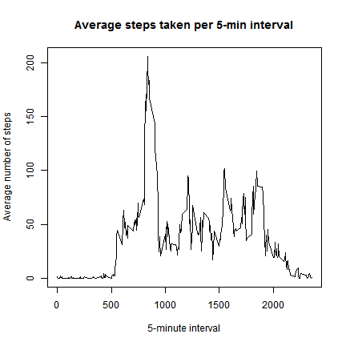
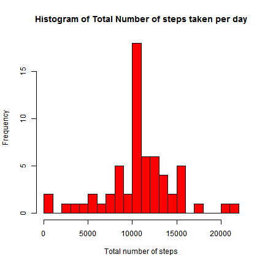
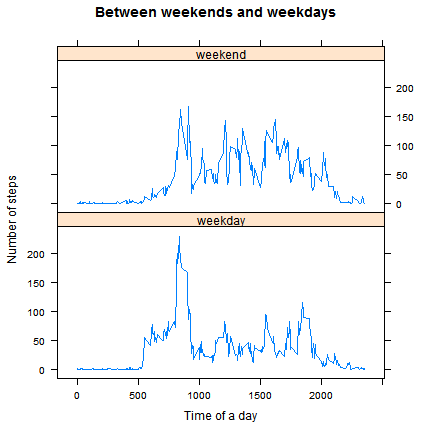

## Introduction
This is a document shows all the steps to complete the peer assessment 1

1.Set global default options, make the cache to speedup the process and figure path for saving image files.

```r
require(knitr)
opts_chunk$set(echo = TRUE, cache = TRUE, cache.path = "cache/", fig.path = "figure/", fig.width = 6, fig.height = 6)
```

2.Load the library for processing

```r
library(dplyr)
library(lubridate)
library(lattice)
```

## Loading and preprocessing the data
1.Unzip and load the data

```r
unzip("activity.zip", overwrite = TRUE)
allActivity <- read.csv("activity.csv",header = TRUE,sep=",",na.strings = "NA", stringsAsFactors = FALSE)
```

2.Transform the column "date" into date format "YY-mm-dd"

```r
allActivity$date <- as.Date(allActivity$date, "%Y-%m-%d")
```

## Calculate the average total number of steps taken per day
1.Group the data by date, and calculate the total number of steps taken per day. 

```r
dailySteps <- allActivity %>%
        group_by(date) %>%
        summarize(sumStep = sum(steps, na.rm = TRUE))
```

2.Plot the histogram of the total number of steps taken each day.

```r
hist(dailySteps$sumStep, col="green", 
     main = "Histogram of Total Number of steps taken per day",
     xlab = "Total number of steps",
     breaks = 20)
```

 

3.Calculate the mean and median of the total number of steps taken per day, ignore the missing values.

```r
avg_dailySteps <- mean(dailySteps$sumStep, na.rm = TRUE)
med_dailySteps <- median(dailySteps$sumStep, na.rm = TRUE)
```
So the mean is 9354.2295082, the median is 10395.


## Explore the average daily activity pattern
1.Group the data by interval, and calculate the averaged steps taken across all days group by interval, ignore the missing value.

```r
intervalMean <- allActivity %>%
        group_by(interval) %>%
        summarize(avgStep = mean(steps, na.rm = TRUE))
```

2.Make a time series plot of the 5-minute interval and the average number of steps taken, averaged across all days.

```r
with(intervalMean, plot(interval,avgStep,
                        type = "l",
                        main = "Average steps taken per 5-min interval",
                        xlab = "5-minute interval",
                        ylab = "Average number of steps")
     )
```

 

3.Find the 5-minute interval, which contains the maximum number of steps, on average across all the days in the dataset.

```r
intervalmax <- intervalMean %>%
        filter(avgStep == max(avgStep))
```
On average across all the days in the dataset, the 5-minute interval: 835, contains the maximum number of steps: 206.1698113.


## Imputing missing values
1.Calculate the total number of missing values in the dataset.

```r
ctNArows <- allActivity %>%
        filter(is.na(steps)==TRUE) %>%
        nrow()
```
And the total number of missing values in the data is 2304

2.Use the mean for each 5-minute interval to fill in all of the above missing values in the dataset.

```r
Newsteps <- vector(length = nrow(allActivity))
for(i in 1:nrow(allActivity))
{
        if(is.na(allActivity$steps[i]))
        {
                Newsteps[i] <- filter(intervalMean, 
                             interval == allActivity$interval[i])$avgStep
        }
        else
        {
                Newsteps[i] <- allActivity$steps[i]
        }
}
```

3. Create a new dataset that is equal to the original dataset but with the missing data filled in.

```r
NewActivity <- allActivity
NewActivity$steps <- Newsteps
```

4. Make a histogram of the total number of steps taken each day with the new dataset with imputed missing data.

```r
dailySteps2 <- NewActivity %>%
        group_by(date) %>%
        summarize(sumStep = sum(steps))            

hist(dailySteps2$sumStep, col="red", 
     main = "Histogram of Total Number of steps taken per day",
     xlab = "Total number of steps",
     breaks = 20)
```

 

```r
avg_dailySteps2 <- mean(dailySteps2$sumStep)
med_dailySteps2 <- median(dailySteps2$sumStep)
isImpact <- ifelse((avg_dailySteps == avg_dailySteps2 |
                    med_dailySteps == med_dailySteps2),
                   "no", "some")
```
In the new data set, the mean is 1.0766189 &times; 10<sup>4</sup>, the median is 1.0766189 &times; 10<sup>4</sup>.
So there is some impact of imputing missing data on the estimates of the total daily number of steps.

## Find the differences in activity patterns between weekdays and weekends.
1. Create a new factor variable in the dataset with two levels -- "weekday" and "weekend" indicating whether a given date is a weekday or weekend day.

```r
NewActivity <- NewActivity %>% 
        mutate(weekday = ifelse(wday(date)>1 & wday(date)<7,
                                "weekday","weekend"))
intervalMean2 <- NewActivity %>%
        group_by(weekday,interval) %>%
        summarize(avgStep = mean(steps)) 
```

2. Make a panel plot containing a time series plot of the 5-minute interval and the average number of steps taken, averaged across all weekday days or weekend days.

```r
xyplot(avgStep ~ interval |weekday, 
       data=intervalMean2,type = "l", 
       layout = c(1,2), 
       main = "Between weekends and weekdays", 
       xlab = "Time of a day", ylab = "Number of steps")
```

 

